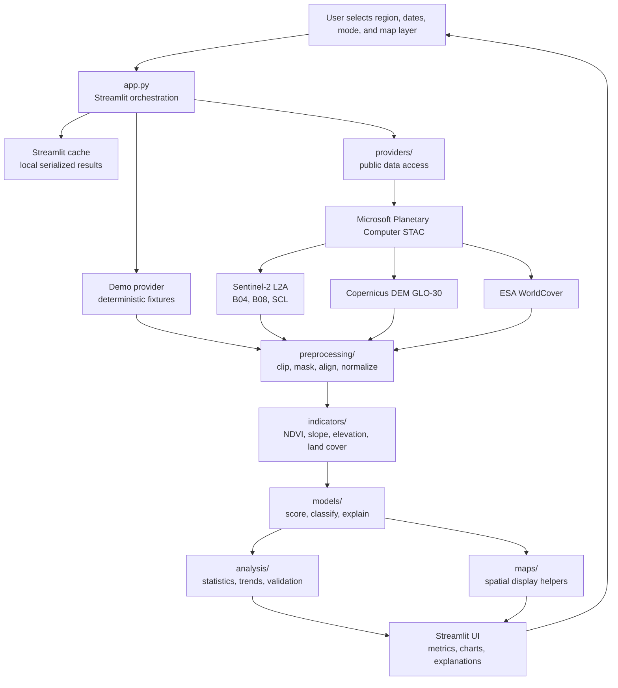
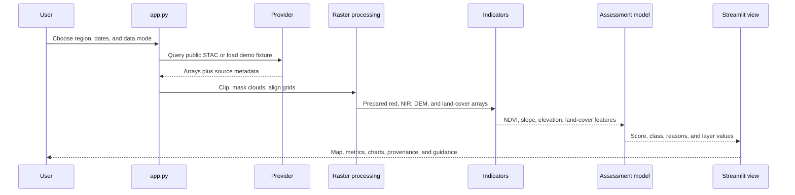

# HimalayaLens

HimalayaLens is a Python-first Streamlit decision-support application for exploring satellite-derived environmental indicators across Uttarakhand. It follows:

**Observe -> Measure -> Compare -> Assess -> Explain**

The app supports two modes: deterministic local demo fixtures for offline development, and a live public-data path using free, anonymous STAC assets. It does not use Google Earth Engine, paid APIs, or credentials.

## Run locally

```powershell
python -m pip install -r requirements.txt
python -m streamlit run app.py
```

Run the pure calculation tests with:

```powershell
python -m pytest
```

## System architecture

HimalayaLens keeps data access, scientific calculations, assessment logic, and presentation separate. `app.py` coordinates these layers but should not become the home for provider downloads or large scientific algorithms.



### Data flow



Large satellite datasets should remain remote or cached locally and must not be committed to Git.

## Folder guide

| Folder | Responsibility | Typical contents |
| --- | --- | --- |
| `config/` | Scientific and application configuration kept outside the UI. | Model weights, thresholds, provider settings. |
| `providers/` | Answers **where data comes from**. Providers query public catalogs or local fixtures and return data plus provenance. | Sentinel-2, DEM, land-cover, and boundary clients. |
| `preprocessing/` | Makes raw data comparable and usable. | Cloud masking, clipping, reprojection, resampling, alignment, normalization. |
| `indicators/` | Answers **what can be measured** from prepared data. | NDVI, elevation, slope, land-cover summaries, change indicators. |
| `models/` | Converts indicators into transparent planning-support assessments. | Feature scoring, thresholds, classification, and explanations. |
| `analysis/` | Produces statistics, trends, summaries, and validation outputs. | Regional comparisons, time-series summaries, validation checks. |
| `maps/` | Keeps spatial display logic separate from scientific calculations. | Layers, legends, map formatting, and spatial helpers. |
| `ui/` | Reusable Streamlit presentation components. | Layout, cards, sidebar, shared styles. |
| `utils/` | Shared technical helpers. | I/O, caching, logging, and common utilities. |
| `data/` | Local working area for small references and ignored large data. | Raw, processed, boundary, reference, and cache directories. |
| `tests/` | Automated checks for calculations and model behavior. | Indicator, scoring, and utility tests. |

## File guide

### Application and configuration

| File | Purpose |
| --- | --- |
| `app.py` | Main Streamlit entry point. Collects controls, loads cached data, calls indicators/models, and renders maps, metrics, charts, explanations, provenance, and limitations. |
| `config/__init__.py` | Marks `config` as a Python package. |
| `config/scoring.py` | Stores provisional suitability weights, class thresholds, and land-cover component scores. |
| `requirements.txt` | Python dependencies for Streamlit, numerical work, testing, STAC access, and raster reading. |
| `.env.example` | Documents the future environment-variable boundary; current public providers need no credentials. |
| `.gitignore` | Excludes virtual environments, caches, secrets, and large local datasets. |

### Data and science modules

| File | Purpose |
| --- | --- |
| `providers/planetary_computer.py` | Queries the public Planetary Computer STAC catalog, signs public assets, reads clipped Sentinel-2/DEM/WorldCover rasters, and returns source metadata. |
| `indicators/demo_data.py` | Creates deterministic demo arrays for offline development and fallback behavior. |
| `indicators/ndvi.py` | Calculates NDVI from red and near-infrared arrays with shape and zero-denominator checks. |
| `indicators/terrain.py` | Calculates slope in degrees from a two-dimensional elevation array. |
| `indicators/landcover.py` | Summarizes land-cover classes as percentage proportions. |
| `models/scoring.py` | Builds bounded indicator components, calculates the provisional weighted score, assigns Green/Yellow/Red, and creates reasons. |
| `models/explanations.py` | Turns model output into plain-language explanations without presenting it as legal, engineering, or AI certainty. |
| `analysis/__init__.py` | Package boundary reserved for statistics, trends, and validation modules. |
| `preprocessing/__init__.py` | Package boundary reserved for raster/vector preprocessing modules. |

### Presentation and support modules

| File | Purpose |
| --- | --- |
| `maps/__init__.py` | Package boundary reserved for map layers, legends, and spatial helpers. |
| `ui/__init__.py` | Package boundary reserved for reusable Streamlit UI components. |
| `utils/__init__.py` | Package boundary reserved for shared I/O, caching, logging, and helper functions. |
| `tests/test_indicators.py` | Tests the NDVI formula, shape validation, flat terrain, and slope response. |
| `tests/test_scoring.py` | Tests bounded assessments, missing-input errors, and explanation wording. |
| `README.md` | Project setup, system architecture, data provenance, methodology, limitations, and development guidance. |

The empty package initializer files are intentional extension points. New provider, preprocessing, indicator, analysis, map, UI, and utility modules should preserve the responsibility boundaries above.

## Data sources

Selecting **Live public data** in the sidebar queries the Microsoft Planetary Computer STAC API at `https://planetarycomputer.microsoft.com/api/stac/v1`:

- **Sentinel-2 Level-2A (`sentinel-2-l2a`)**: B04 red and B08 near-infrared bands for NDVI, plus SCL for cloud, shadow, snow, and invalid-pixel masking. The provider selects the lowest-cloud scene in the requested window, subject to a 60% cloud-cover filter.
- **Copernicus DEM GLO-30 (`cop-dem-glo-30`)**: elevation and derived slope.
- **ESA WorldCover (`esa-worldcover`)**: categorical land-cover classes mapped into readable groups such as forest, agriculture, built-up, water, bare, and snow-ice.

The provider clips and resamples remote Cloud Optimized GeoTIFF assets to a compact common display grid. The app shows the Sentinel-2 item ID, acquisition timestamp, cloud cover, and provider name under **Methodology and data provenance**. The live result is cached with Streamlit for one day.

The current live slice is a current-observation MVP: historical NDVI comparison is not yet a second Sentinel-2 acquisition, so the provider currently mirrors the current NDVI for that field. A subsequent change-detection slice should query a separate historical window and record both item IDs.

If a public request fails because of connectivity, no matching imagery, provider changes, or missing local geospatial dependencies, the app reports the failure and uses a clearly labeled demo fallback. It never silently presents demo values as satellite observations.

## Method and limitations

NDVI is calculated as `(NIR - RED) / (NIR + RED)`. Terrain slope is derived from an elevation surface. The initial suitability score is a provisional weighted rule-based model, not AI. Its weights and thresholds require published guidance, empirical validation, and sensitivity analysis.

Satellite observations can be affected by clouds, shadows, haze, snow, seasonality, terrain effects, spatial resolution, and classification errors. The output is environmental planning support only. It is not legal construction approval, professional engineering or geotechnical assessment, or a guaranteed landslide or flood prediction.

## Live-data dependencies

The live provider uses `pystac-client`, `planetary-computer`, and `rasterio`. Confirm that the selected VS Code Python interpreter can import all three packages before selecting Live public data. The offline tests do not require a network connection or a live provider response.